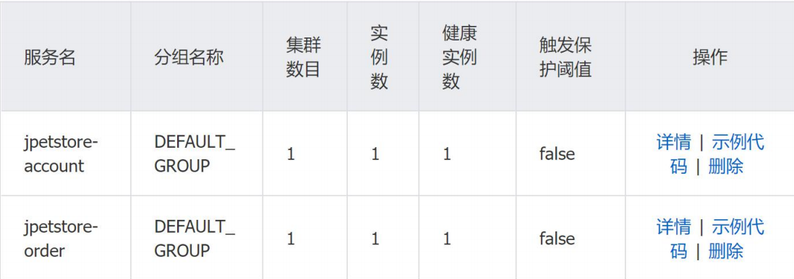

### **目标与期望**

微服务的便捷性使得微服务架构成为很多企业重构的方向，这也对软件架构师带来了更大的挑战。为了便于进行遗留系统的迁移，本项目选择基于执行跟踪聚类和基于过程挖掘这两种方法，用以辅助完成遗留系统的拆分工作，拆分完成后，使用 Spring Cloud 微服务框架来实现拆分的系统。

### **技术栈**

- 框架： Spring Cloud & Spring Cloud Alibaba
- API网关：Spring Cloud Gateway
- 服务注册&发现和配置中心: Alibaba Nacos
- 服务消费：Spring Cloud OpenFeign
- 数据缓存：Redis(微服务间session共享)
- 数据库： MySQL

### **前置条件**

- 启动Redis服务器
- 启动Nacos服务注册中心

### **具体步骤**

1. 克隆代码库： `git clone https://github.com/zzsnowy/microservice-migration.git`

2. 进入每个微服务：

   `mvn clean compile`

   `mvn spring-boot:run`

3. 查看服务注册中心服务名及实例数，若没有服务则启动失败。下图表示account服务和order服务启动成功。

   
